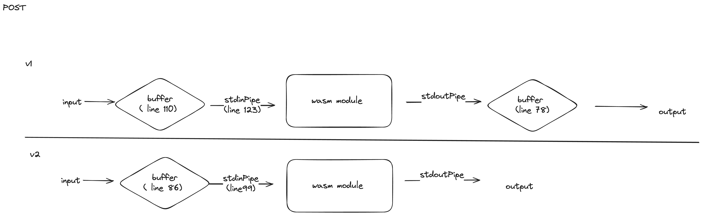

The main difference between Version 1 and Version 2 is how they handle data fetching and display.


# v1
Version 1 saves the standard output in a buffer and displays it using that buffer. 
-  the current problem is that it is fetching the previous buffer instead of the latest one. The new data is not fetched, and it continues to display the older buffer.

# v2
Version 2 directly displays the data, but it is not retrieving the output correctly after the curl command.

### Testing 
```
curl -X POST -d $'Bye!!' http://localhost:8080/
```
```
curl -X POST -d $'Hello, Wasm\nHi there!' http://localhost:8080/ 
```